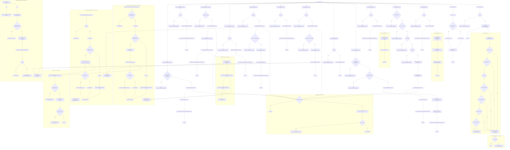

# AnnotationsApiController Code Paths

```mermaid
flowchart TD
  S([AnnotationsApiController])

  %% =========================
  %% Endpoint entry points
  %% =========================
  S --> E1["GET /annotate/mutations/byProteinChange"]
  S --> E2["POST /annotate/mutations/byProteinChange"]
  S --> E3["GET /annotate/mutations/byGenomicChange"]
  S --> E4["POST /annotate/mutations/byGenomicChange"]
  S --> E5["GET /annotate/mutations/byHGVSg"]
  S --> E6["POST /annotate/mutations/byHGVSg"]
  S --> E7["GET /annotate/mutations/byHGVSc"]
  S --> E8["POST /annotate/mutations/byHGVSc"]
  S --> E9["GET /annotate/copyNumberAlterations"]
  S --> E10["POST /annotate/copyNumberAlterations"]
  S --> E11["GET /annotate/structuralVariants"]
  S --> E12["POST /annotate/structuralVariants"]
  S --> E13["GET /annotation/search"]
  S --> E14["POST /annotate/sample"]

  %% =========================
  %% GET byProteinChange
  %% =========================
  E1 --> C1{"entrezGeneId && hugoSymbol && !isSameGene?"}
  C1 -- yes --> X1["throw ApiHttpErrorException(BAD_REQUEST)"]
  C1 -- no --> M1["resolveMatchedRG(referenceGenome)"]
  M1 --> M2["cacheFetcher.processQuery(...)"]
  M2 --> R1["JsonResultFactory.getIndicatorQueryRespWithoutGermline(...)"]
  R1 --> O1["200 OK"]

  %% =========================
  %% POST byProteinChange
  %% =========================
  E2 --> C2{"body == null?"}
  C2 -- yes --> X2["throw ApiHttpErrorException(BAD_REQUEST)"]
  C2 -- no --> M3["annotateMutationsByProteinChange(body)"]
  M3 --> R2["JsonResultFactory.getIndicatorQueryRespWithoutGermline(...)"]
  R2 --> O2["200 OK"]

  %% =========================
  %% GET byGenomicChange
  %% =========================
  E3 --> C3{"genomicLocation empty?"}
  C3 -- yes --> X3["throw ApiHttpErrorException(BAD_REQUEST)"]
  C3 -- no --> M4["resolveMatchedRG(referenceGenome)"]
  M4 --> M5["build AnnotateMutationByGenomicChangeQuery"]
  M5 --> M6["annotateMutationsByGenomicChange([query])"]
  M6 --> R3["JsonResultFactory.getIndicatorQueryRespWithoutGermline(...)"]
  R3 --> O3["200 OK"]

  %% =========================
  %% POST byGenomicChange
  %% =========================
  E4 --> C4{"body == null?"}
  C4 -- yes --> X4["throw ApiHttpErrorException(BAD_REQUEST)"]
  C4 -- no --> M7["annotateMutationsByGenomicChange(body)"]
  M7 --> R4["JsonResultFactory.getIndicatorQueryRespWithoutGermline(...)"]
  R4 --> O4["200 OK"]

  %% =========================
  %% GET byHGVSg
  %% =========================
  E5 --> C5{"hgvsg empty?"}
  C5 -- yes --> X5["throw ApiHttpErrorException(BAD_REQUEST)"]
  C5 -- no --> M8["resolveMatchedRG(referenceGenome)"]
  M8 --> C6{"AlterationUtils.isValidHgvsg(hgvsg)?"}
  C6 -- no --> X6["throw ApiHttpErrorException(BAD_REQUEST)"]
  C6 -- yes --> M9["build AnnotateMutationByHGVSgQuery"]
  M9 --> M10["annotateMutationsByHGVSg([query])"]
  M10 --> R5["JsonResultFactory.getIndicatorQueryRespWithoutGermline(...)"]
  R5 --> O5["200 OK"]

  %% =========================
  %% POST byHGVSg
  %% =========================
  E6 --> C7{"body == null?"}
  C7 -- yes --> X7["throw ApiHttpErrorException(BAD_REQUEST)"]
  C7 -- no --> M11["annotateMutationsByHGVSg(body)"]
  M11 --> R6["JsonResultFactory.getIndicatorQueryRespWithoutGermline(...)"]
  R6 --> O6["200 OK"]

  %% =========================
  %% GET byHGVSc
  %% =========================
  E7 --> C8{"hgvsc empty?"}
  C8 -- yes --> X8["throw ApiHttpErrorException(BAD_REQUEST)"]
  C8 -- no --> M12["resolveMatchedRG(referenceGenome)"]
  M12 --> C9{"AlterationUtils.isValidHgvsc(hgvsc)?"}
  C9 -- no --> X9["throw ApiHttpErrorException(BAD_REQUEST)"]
  C9 -- yes --> M13["build AnnotateMutationByHGVScQuery"]
  M13 --> M14["annotateMutationsByHGVSc([query])"]
  M14 --> O7["200 OK"]

  %% =========================
  %% POST byHGVSc
  %% =========================
  E8 --> C10{"body == null?"}
  C10 -- yes --> X10["throw ApiHttpErrorException(BAD_REQUEST)"]
  C10 -- no --> M15["annotateMutationsByHGVSc(body)"]
  M15 --> O8["200 OK"]

  %% =========================
  %% GET copyNumberAlterations
  %% =========================
  E9 --> C11{"entrezGeneId && hugoSymbol && !isSameGene?"}
  C11 -- yes --> X11["throw ApiHttpErrorException(BAD_REQUEST)"]
  C11 -- no --> C12{"copyNameAlterationType == null?"}
  C12 -- yes --> X12["throw ApiHttpErrorException(BAD_REQUEST)"]
  C12 -- no --> M16["resolveMatchedRG(referenceGenome)"]
  M16 --> M17["cacheFetcher.processQuery(...)"]
  M17 --> R7["JsonResultFactory.getIndicatorQueryRespWithoutGermline(...)"]
  R7 --> O9["200 OK"]

  %% =========================
  %% POST copyNumberAlterations
  %% =========================
  E10 --> C13{"body == null?"}
  C13 -- yes --> X13["throw ApiHttpErrorException(BAD_REQUEST)"]
  C13 -- no --> M18["annotateCopyNumberAlterations(body)"]
  M18 --> R8["JsonResultFactory.getIndicatorQueryRespWithoutGermline(...)"]
  R8 --> O10["200 OK"]

  %% =========================
  %% GET structuralVariants
  %% =========================
  E11 --> C14{"structuralVariantType == null?"}
  C14 -- yes --> X14["throw ApiHttpErrorException(BAD_REQUEST)"]
  C14 -- no --> C15{"isFunctionalFusion == null?"}
  C15 -- yes --> X15["throw ApiHttpErrorException(BAD_REQUEST)"]
  C15 -- no --> C16{"gene A mismatch?"}
  C16 -- yes --> X16["throw ApiHttpErrorException(BAD_REQUEST)"]
  C16 -- no --> C17{"gene B mismatch?"}
  C17 -- yes --> X17["throw ApiHttpErrorException(BAD_REQUEST)"]
  C17 -- no --> M19["findGeneBySymbol(A) with fallback Gene()"]
  M19 --> M20["findGeneBySymbol(B) with fallback Gene()"]
  M20 --> M21["resolveMatchedRG(referenceGenome)"]
  M21 --> M22["fusionName = FusionUtils.getFusionName(geneA, geneB)"]
  M22 --> M23["cacheFetcher.processQuery(... STRUCTURAL_VARIANT ...)"]
  M23 --> R9["JsonResultFactory.getIndicatorQueryRespWithoutGermline(...)"]
  R9 --> O11["200 OK"]

  %% =========================
  %% POST structuralVariants
  %% =========================
  E12 --> C18{"body == null?"}
  C18 -- yes --> X18["throw ApiHttpErrorException(BAD_REQUEST)"]
  C18 -- no --> M24["annotateStructuralVariants(body)"]
  M24 --> R10["JsonResultFactory.getIndicatorQueryRespWithoutGermline(...)"]
  R10 --> O12["200 OK"]

  %% =========================
  %% GET annotation/search
  %% =========================
  E13 --> M25["if limit == null -> 10"]
  M25 --> C19{"query != null && query.length >= 2?"}
  C19 -- yes --> M26["annotationSearch(query)"]
  C19 -- no --> M27["result = empty TreeSet"]
  M26 --> M28["orderedResult + MainUtils.getLimit(...)"]
  M27 --> M28
  M28 --> O13["200 OK"]

  %% =========================
  %% POST annotate/sample
  %% =========================
  E14 --> C20{"body == null?"}
  C20 -- yes --> X19["throw ApiHttpErrorException(BAD_REQUEST)"]
  C20 -- no --> L1["for each AnnotateSampleQuery -> annotateSample(query)"]
  L1 --> O14["200 OK"]

  %% =========================
  %% Shared helper methods and internal branching
  %% =========================

  subgraph H1["resolveMatchedRG(referenceGenome)"]
    HR1{"referenceGenome empty?"}
    HR1 -- yes --> HR2["return null"]
    HR1 -- no --> HR3["MainUtils.searchEnum(ReferenceGenome, value)"]
    HR3 --> HR4{"matchedRG == null?"}
    HR4 -- yes --> HR5["throw ApiHttpErrorException(BAD_REQUEST)"]
    HR4 -- no --> HR6["return matchedRG"]
  end
  M1 --> HR1
  M4 --> HR1
  M8 --> HR1
  M12 --> HR1
  M16 --> HR1
  M21 --> HR1

  subgraph H2["annotateMutationsByGenomicChange(List)"]
    G1["split queries into GRCh37/GRCh38 (default GRCh37)"]
    G2["annotateMutationsByGenomicChange(GRCh37, queries)"]
    G3["annotateMutationsByGenomicChange(GRCh38, queries)"]
    G4["rebuild output in original order"]
    G1 --> G2 --> G3 --> G4
  end
  M6 --> G1
  M7 --> G1

  subgraph H3["annotateMutationsByGenomicChange(referenceGenome, queries)"]
    GG1["build Genome Nexus request list for annotatable genomic locations"]
    GG2["GenomeNexusUtils.getGenomicLocationVariantsAnnotation(...)"]
    GG2 --> GG3{"variantAnnotations.size == queriesToGN.size?"}
    GG3 -- no --> GG4["throw ApiException"]
    GG3 -- yes --> GG5["for each query"]
    GG5 --> GG6{"queryIndexMap contains genomicLocation?"}
    GG6 -- yes --> GG7["get alterations from Genome Nexus"]
    GG7 --> GG8["getIndicatorQueryForCuratedHgvs(...)"]
    GG8 --> GG9{"indicator == null && !germline?"}
    GG9 -- yes --> GG10["getIndicatorQueryFromGenomicLocation(...)"]
    GG9 -- no --> GG11["keep curated result"]
    GG6 -- no --> GG12["fallback"]
    GG10 --> GG13["set query id + add result"]
    GG11 --> GG13
    GG12 --> GG14["getIndicatorQueryFromGenomicLocation(empty summary)"]
    GG14 --> GG13
  end
  G2 --> GG1
  G3 --> GG1

  subgraph H4["annotateMutationsByHGVSg(List/referenceGenome)"]
    HG1["split queries into GRCh37/GRCh38 (default GRCh37)"]
    HG2["build HGVSg list for Genome Nexus when hgvsgShouldBeAnnotated"]
    HG3["GenomeNexusUtils.getHgvsVariantsAnnotation(...)"]
    HG3 --> HG4{"size match?"}
    HG4 -- no --> HG5["throw ApiException"]
    HG4 -- yes --> HG6["for each query"]
    HG6 --> HG7{"query mapped to Genome Nexus result?"}
    HG7 -- yes --> HG8["getAlterationsFromGenomeNexus + getIndicatorQueryForCuratedHgvs"]
    HG8 --> HG9{"indicator == null && !germline?"}
    HG9 -- yes --> HG10["getIndicatorQueryFromHGVS(...)"]
    HG9 -- no --> HG11["keep curated result"]
    HG7 -- no --> HG12["fallback"]
    HG12 --> HG13["getIndicatorQueryFromHGVS(empty summary)"]
    HG10 --> HG14["set query id + add result"]
    HG11 --> HG14
    HG13 --> HG14
  end
  M10 --> HG1
  M11 --> HG1

  subgraph H5["getIndicatorQueryForCuratedHgvs(...)"]
    CH1["findAlterationWithGeneticType(referenceGenome, hgvsg, ...)"]
    CH1 --> CH2{"alteration != null && germline matches?"}
    CH2 -- yes --> CH3["cacheFetcher.processQuery(... hgvsg ...)"]
    CH2 -- no --> CH4["extract hgvsc from transcript summary if present"]
    CH4 --> CH5{"usable hgvsc and curated alteration found?"}
    CH5 -- yes --> CH6["cacheFetcher.processQuery(... hgvsc + hgvsg ...)"]
    CH5 -- no --> CH7["return null"]
  end
  GG8 --> CH1
  HG8 --> CH1

  subgraph H6["annotateMutationsByHGVSc(List/referenceGenome)"]
    HC1["split queries into GRCh37/GRCh38 (default GRCh37)"]
    HC2["for each query: hgvscShouldBeAnnotated?"]
    HC2 --> HC3{"no"}
    HC3 --> HC4["getIndicatorQueryFromHGVS(empty summary)"]
    HC2 --> HC5{"yes"}
    HC5 --> HC6["find curated alteration by query.getAlteration()"]
    HC6 --> HC7{"germline OR curated somatic alteration exists?"}
    HC7 -- yes --> HC8["cacheFetcher.processQuery(...)"]
    HC7 -- no --> HC9["queue query for Genome Nexus; keep result placeholder null"]
    HC9 --> HC10["GenomeNexusUtils.getHgvsVariantsAnnotation(...)"]
    HC10 --> HC11{"size match?"}
    HC11 -- no --> HC12["throw ApiException"]
    HC11 -- yes --> HC13["fill placeholders via getIndicatorQueryFromHGVS(...)"]
  end
  M14 --> HC1
  M15 --> HC1

  subgraph H7["annotateCopyNumberAlterations(List)"]
    CN1["for each query: optional findGeneBySymbol with fallback"]
    CN2["cacheFetcher.processQuery(...)"]
    CN3["set query id"]
    CN1 --> CN2 --> CN3
  end
  M18 --> CN1

  subgraph H8["annotateStructuralVariants(List)"]
    SV1["for each query: resolve geneA/geneB via findGeneBySymbol with fallback"]
    SV2["fusionName = FusionUtils.getFusionName(geneA, geneB)"]
    SV3["cacheFetcher.processQuery(... STRUCTURAL_VARIANT ...)"]
    SV4["set query id"]
    SV1 --> SV2 --> SV3 --> SV4
  end
  M24 --> SV1

  subgraph H9["annotateSample(sample)"]
    AS1["init output buckets + set sample id/tumorType"]
    AS2{"structuralVariants != null?"}
    AS3{"copyNumberAlterations != null?"}
    AS4{"mutations != null?"}
    AS5{"mutations.genomicChange != null?"}
    AS6{"mutations.proteinChange != null?"}
    AS7{"mutations.hgvsg != null?"}
    AS8{"mutations.cDnaChange != null?"}
    AS9["setTumorTypeForQueries(...) + call corresponding annotate* method"]
    AS10["merge mutation lists and set on SampleQueryResp"]
    AS1 --> AS2
    AS2 --> AS3
    AS3 --> AS4
    AS4 --> AS5
    AS5 --> AS6
    AS6 --> AS7
    AS7 --> AS8
    AS2 -- yes --> AS9
    AS3 -- yes --> AS9
    AS5 -- yes --> AS9
    AS6 -- yes --> AS9
    AS7 -- yes --> AS9
    AS8 -- yes --> AS9
    AS8 --> AS10
  end
  L1 --> AS1

  subgraph H10["setTumorTypeForQueries(queries, tumorType)"]
    ST1{"tumorType empty?"}
    ST1 -- yes --> ST2["return"]
    ST1 -- no --> ST3["for each query -> query.setTumorType(tumorType)"]
  end
  AS9 --> ST1
```
