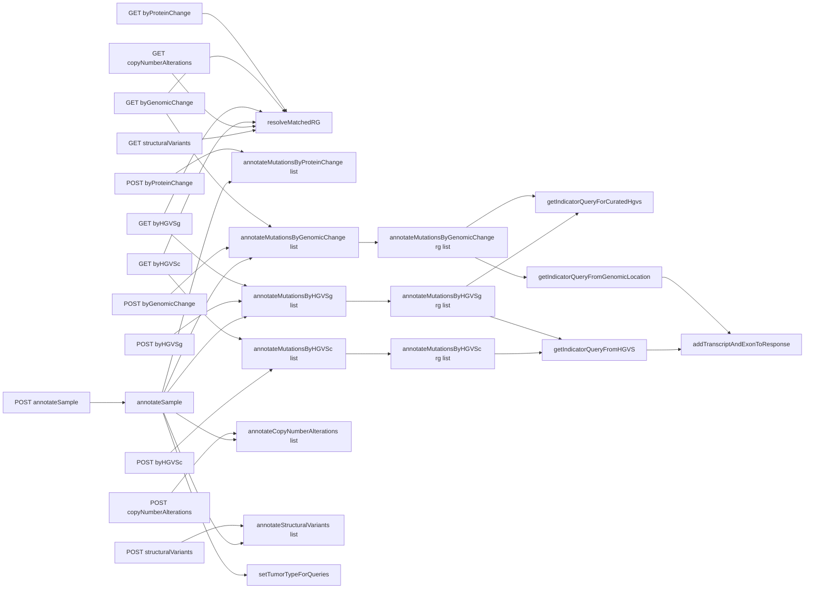

# 00 Controller Call Graph (Drill-Down Index)

## Method Diagram Links
- `resolveMatchedRG`: `diagram/methods/resolveMatchedRG.md`
- `annotateMutationsByProteinChange(List)`: `diagram/methods/annotateMutationsByProteinChange-list.md`
- `annotateMutationsByGenomicChange(List)`: `diagram/methods/annotateMutationsByGenomicChange-list.md`
- `annotateMutationsByGenomicChange(ReferenceGenome,List)`: `diagram/methods/annotateMutationsByGenomicChange-rg-list.md`
- `getIndicatorQueryForCuratedHgvs`: `diagram/methods/getIndicatorQueryForCuratedHgvs.md`
- `getIndicatorQueryFromGenomicLocation`: `diagram/methods/getIndicatorQueryFromGenomicLocation.md`
- `getIndicatorQueryFromHGVS`: `diagram/methods/getIndicatorQueryFromHGVS.md`
- `annotateMutationsByHGVSg(List)`: `diagram/methods/annotateMutationsByHGVSg-list.md`
- `annotateMutationsByHGVSg(ReferenceGenome,List)`: `diagram/methods/annotateMutationsByHGVSg-rg-list.md`
- `annotateMutationsByHGVSc(List)`: `diagram/methods/annotateMutationsByHGVSc-list.md`
- `annotateMutationsByHGVSc(ReferenceGenome,List)`: `diagram/methods/annotateMutationsByHGVSc-rg-list.md`
- `addTranscriptAndExonToResponse`: `diagram/methods/addTranscriptAndExonToResponse.md`
- `annotateStructuralVariants(List)`: `diagram/methods/annotateStructuralVariants-list.md`
- `annotateCopyNumberAlterations(List)`: `diagram/methods/annotateCopyNumberAlterations-list.md`
- `annotateSample`: `diagram/methods/annotateSample.md`
- `setTumorTypeForQueries`: `diagram/methods/setTumorTypeForQueries.md`
- `processQuery (CacheFetcher + IndicatorUtils)`: `diagram/methods/processQuery.md`
