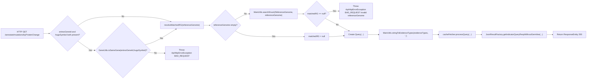

# 01 GET /annotate/mutations/byProteinChange

```mermaid
flowchart LR
  A["HTTP GET /annotate/mutations/byProteinChange"] --> B{"entrezGeneId and hugoSymbol both present?"}
  B -- No --> E["resolveMatchedRG(referenceGenome)"]
  B -- Yes --> C{"GeneUtils.isSameGene(entrezGeneId,hugoSymbol)?"}
  C -- No --> D["Throw ApiHttpErrorException BAD_REQUEST"]
  C -- Yes --> E

  E --> F{"referenceGenome empty?"}
  F -- Yes --> G["matchedRG = null"]
  F -- No --> H["MainUtils.searchEnum(ReferenceGenome, referenceGenome)"]
  H --> I{"matchedRG == null?"}
  I -- Yes --> D2["Throw ApiHttpErrorException BAD_REQUEST invalid referenceGenome"]
  I -- No --> J["Create Query(...)"]
  G --> J

  J --> K["MainUtils.stringToEvidenceTypes(evidenceTypes, ',')"]
  K --> L["cacheFetcher.processQuery(...)"]
  L --> M["JsonResultFactory.getIndicatorQueryRespWithoutGermline(...)"]
  M --> N["Return ResponseEntity 200"]
```

## Drill-Down
- `resolveMatchedRG`: `diagram/methods/resolveMatchedRG.md`
