# 03 GET /annotate/mutations/byGenomicChange

```mermaid
flowchart LR
  A["HTTP GET /annotate/mutations/byGenomicChange"] --> B{"genomicLocation empty?"}
  B -- Yes --> C["Throw ApiHttpErrorException BAD_REQUEST"]
  B -- No --> D["resolveMatchedRG(referenceGenome)"]

  D --> E{"referenceGenome empty?"}
  E -- No --> F["MainUtils.searchEnum(...)"]
  F --> G{"matchedRG null?"}
  G -- Yes --> H["Throw ApiHttpErrorException BAD_REQUEST invalid referenceGenome"]
  G -- No --> I["Build single AnnotateMutationByGenomicChangeQuery"]
  E -- Yes --> I

  I --> J["set genomicLocation/referenceGenome/tumorType/germline=false/evidenceTypes"]
  J --> K["annotateMutationsByGenomicChange(singleton)"]

  K --> L["Partition queries by RG into grch37/grch38"]
  L --> M["annotateMutationsByGenomicChange(GRCh37, grch37Queries)"]
  L --> N["annotateMutationsByGenomicChange(GRCh38, grch38Queries)"]
  M --> O["Reassemble original order"]
  N --> O

  O --> P["Per RG helper: build queriesToGN via GenomeNexusUtils.convertGenomicLocation + cacheFetcher.genomicLocationShouldBeAnnotated"]
  P --> Q["GenomeNexusUtils.getGenomicLocationVariantsAnnotation"]
  Q --> R{"variantAnnotations size mismatch?"}
  R -- Yes --> S["Throw ApiException"]
  R -- No --> T["Loop each query"]

  T --> U{"query in queryIndexMap?"}
  U -- No --> V["getIndicatorQueryFromGenomicLocation(empty transcript)"]
  U -- Yes --> W["AlterationUtils.getAlterationsFromGenomeNexus"]
  W --> X["getIndicatorQueryForCuratedHgvs(...)"]

  X --> Y{"curated response found?"}
  Y -- Yes --> Z["use curated response"]
  Y -- No --> AA{"query germline == false?"}
  AA -- Yes --> AB["getIndicatorQueryFromGenomicLocation(selected transcript)"]
  AA -- No --> AC["indicator remains null"]
  AC --> V

  AB --> AD["set hgvsInfo"]
  AD --> AE["set response query id"]
  Z --> AE
  V --> AE
  AE --> AF{"More queries?"}
  AF -- Yes --> T
  AF -- No --> AG["return list"]

  AG --> AH["first element taken in GET handler"]
  AH --> AI["JsonResultFactory.getIndicatorQueryRespWithoutGermline"]
  AI --> AJ["Return ResponseEntity 200"]

  subgraph CURATED["getIndicatorQueryForCuratedHgvs"]
    X1["find alteration by hgvsg via AlterationUtils.findAlterationWithGeneticType"] --> X2{"match and germline aligned?"}
    X2 -- Yes --> X3["cacheFetcher.processQuery using hgvsg"]
    X2 -- No --> X4["extract hgvsc from transcript summary"]
    X4 --> X5{"hgvsc has two parts gene:alteration?"}
    X5 -- No --> X8["return null"]
    X5 -- Yes --> X6["find alteration by hgvsc-part"]
    X6 --> X7{"match and germline aligned?"}
    X7 -- Yes --> X9["cacheFetcher.processQuery using hgvsc + hgvsg"]
    X7 -- No --> X8
  end

  subgraph FROM_LOC["getIndicatorQueryFromGenomicLocation"]
    GL1["QueryUtils.getQueryFromAlteration"] --> GL2["cacheFetcher.processQuery"]
    GL2 --> GL3["addTranscriptAndExonToResponse"]
    GL3 --> GL4["set query.hgvsInfo"]
  end
```

## Drill-Down
- `resolveMatchedRG`: `diagram/methods/resolveMatchedRG.md`
- `annotateMutationsByGenomicChange(List)`: `diagram/methods/annotateMutationsByGenomicChange-list.md`
