# 05 GET /annotate/mutations/byHGVSg

```mermaid
flowchart LR
  A["HTTP GET /annotate/mutations/byHGVSg"] --> B{"hgvsg empty?"}
  B -- Yes --> C["Throw ApiHttpErrorException BAD_REQUEST"]
  B -- No --> D["resolveMatchedRG(referenceGenome)"]

  D --> E{"referenceGenome empty?"}
  E -- No --> F["MainUtils.searchEnum"]
  F --> G{"matchedRG null?"}
  G -- Yes --> H["Throw ApiHttpErrorException BAD_REQUEST invalid referenceGenome"]
  G -- No --> I{"AlterationUtils.isValidHgvsg(hgvsg)?"}
  E -- Yes --> I
  I -- No --> J["Throw ApiHttpErrorException BAD_REQUEST invalid hgvsg"]
  I -- Yes --> K["Build single AnnotateMutationByHGVSgQuery"]

  K --> L["set hgvsg/referenceGenome/tumorType/germline=false/evidenceTypes"]
  L --> M["annotateMutationsByHGVSg(singleton)"]

  M --> N["Partition by RG; null defaults to GRCh37"]
  N --> N1{"Partition complete?"}
  N1 -- Yes --> O["annotateMutationsByHGVSg(GRCh37, grch37Queries)"]
  O --> O1{"Always invoke GRCh38 helper next?"}
  O1 -- Yes --> P["annotateMutationsByHGVSg(GRCh38, grch38Queries)"]
  P --> Q["Reassemble original order"]

  Q --> R["Per RG helper: dedupe hgvsg requiring GN via cacheFetcher.hgvsgShouldBeAnnotated"]
  R --> S["GenomeNexusUtils.getHgvsVariantsAnnotation"]
  S --> T{"annotation count mismatch?"}
  T -- Yes --> U["Throw ApiException"]
  T -- No --> V["Loop each query"]

  V --> W{"Query had GN annotation?"}
  W -- No --> X["getIndicatorQueryFromHGVS(empty transcript)"]
  W -- Yes --> Y["AlterationUtils.getAlterationsFromGenomeNexus"]
  Y --> Z["getIndicatorQueryForCuratedHgvs"]
  Z --> A1{"Curated response found?"}
  A1 -- Yes --> A2["Use curated response"]
  A1 -- No --> A3{"query.germline false?"}
  A3 -- Yes --> A4["getIndicatorQueryFromHGVS(selected transcript)"]
  A3 -- No --> A5["indicator remains null"]
  A5 --> X

  A4 --> A6["set hgvsInfo"]
  A6 --> A7["set response query id"]
  A2 --> A7
  X --> A7
  A7 --> A8{"More queries?"}
  A8 -- Yes --> V
  A8 -- No --> A9["return list"]

  A9 --> B1["first element used by GET"]
  B1 --> B2["JsonResultFactory.getIndicatorQueryRespWithoutGermline"]
  B2 --> B3["Return ResponseEntity 200"]

  subgraph CURATED["getIndicatorQueryForCuratedHgvs"]
    C1["find alteration by hgvsg"] --> C2{"match + germline aligned?"}
    C2 -- Yes --> C3["cacheFetcher.processQuery"]
    C2 -- No --> C4["read transcript hgvsc"]
    C4 --> C5{"hgvsc split has 2 parts?"}
    C5 -- Yes --> C6["find alteration by hgvsc part"]
    C6 --> C7{"match + germline aligned?"}
    C7 -- Yes --> C8["cacheFetcher.processQuery"]
    C7 -- No --> C9["return null"]
    C5 -- No --> C9
  end

  subgraph FROM_HGVS["getIndicatorQueryFromHGVS"]
    H1["QueryUtils.getQueryFromAlteration"] --> H2["cacheFetcher.processQuery"]
    H2 --> H3["addTranscriptAndExonToResponse"]
    H3 --> H4["set query.hgvsInfo"]
  end
```

## Drill-Down
- `resolveMatchedRG`: `diagram/methods/resolveMatchedRG.md`
- `annotateMutationsByHGVSg(List)`: `diagram/methods/annotateMutationsByHGVSg-list.md`
