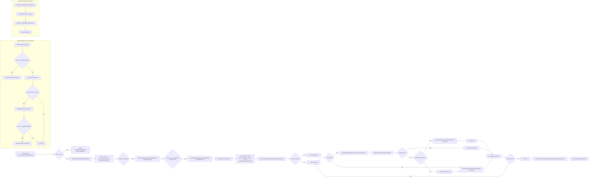

# 06 POST /annotate/mutations/byHGVSg

```mermaid
flowchart LR
  A["HTTP POST /annotate/mutations/byHGVSg"] --> B{"body == null?"}
  B -- Yes --> C["Throw ApiHttpErrorException BAD_REQUEST"]
  B -- No --> D["annotateMutationsByHGVSg(body)"]

  D --> E["Partition body by referenceGenome; null defaults to GRCh37"]
  E --> E1{"Partition complete?"}
  E1 -- Yes --> F["annotateMutationsByHGVSg(GRCh37, grch37Queries)"]
  F --> F1{"Always invoke GRCh38 helper next?"}
  F1 -- Yes --> G["annotateMutationsByHGVSg(GRCh38, grch38Queries)"]
  G --> H["Reassemble original order"]

  H --> I["Per RG helper: build deduped GN list by hgvsg when hgvsgShouldBeAnnotated"]
  I --> J["GenomeNexusUtils.getHgvsVariantsAnnotation"]
  J --> K{"count mismatch?"}
  K -- Yes --> L["Throw ApiException"]
  K -- No --> M["Loop each query"]

  M --> N{"In GN map?"}
  N -- No --> O["getIndicatorQueryFromHGVS(empty transcript)"]
  N -- Yes --> P["AlterationUtils.getAlterationsFromGenomeNexus"]
  P --> Q["getIndicatorQueryForCuratedHgvs"]
  Q --> R{"curated found?"}
  R -- Yes --> S["Use curated response"]
  R -- No --> T{"query.germline false?"}
  T -- Yes --> U["getIndicatorQueryFromHGVS(selected transcript)"]
  T -- No --> V["indicator remains null"]
  V --> O

  U --> W["set hgvsInfo"]
  W --> X["set response query id"]
  S --> X
  O --> X
  X --> Y{"More queries?"}
  Y -- Yes --> M
  Y -- No --> Z["return list"]

  Z --> A1["JsonResultFactory.getIndicatorQueryRespWithoutGermline"]
  A1 --> A2["Return ResponseEntity 200"]

  subgraph CURATED["getIndicatorQueryForCuratedHgvs"]
    C1["find alteration by hgvsg"] --> C2{"match + germline aligned?"}
    C2 -- Yes --> C3["cacheFetcher.processQuery"]
    C2 -- No --> C4["extract transcript hgvsc"]
    C4 --> C5{"hgvsc split has 2 parts?"}
    C5 -- Yes --> C6["find alteration by hgvsc part"]
    C6 --> C7{"match + germline aligned?"}
    C7 -- Yes --> C8["cacheFetcher.processQuery"]
    C7 -- No --> C9["return null"]
    C5 -- No --> C9
  end

  subgraph FROM_HGVS["getIndicatorQueryFromHGVS"]
    H1["QueryUtils.getQueryFromAlteration"] --> H2["cacheFetcher.processQuery"]
    H2 --> H3["addTranscriptAndExonToResponse"]
    H3 --> H4["set query.hgvsInfo"]
  end
```

## Drill-Down
- `annotateMutationsByHGVSg(List)`: `diagram/methods/annotateMutationsByHGVSg-list.md`
