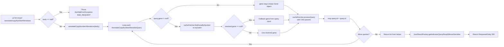

# 10 POST /annotate/copyNumberAlterations

```mermaid
flowchart LR
  A["HTTP POST /annotate/copyNumberAlterations"] --> B{body == null?}
  B -- Yes --> C["Throw ApiHttpErrorException BAD_REQUEST"]
  B -- No --> D["annotateCopyNumberAlterations(body)"]

  D --> E["Loop each AnnotateCopyNumberAlterationQuery"]
  E --> F{query.gene != null?}
  F -- No --> G["gene stays empty Gene object"]
  F -- Yes --> H["cacheFetcher.findGeneBySymbol in try/catch"]
  H --> I{resolved gene == null?}
  I -- Yes --> J["Fallback gene from query input"]
  I -- No --> K["Use resolved gene"]
  G --> L["cacheFetcher.processQuery with CNA params"]
  J --> L
  K --> L

  L --> M["resp.query.id = query.id"]
  M --> N{More queries?}
  N -- Yes --> E
  N -- No --> O["Return list from helper"]

  O --> P["JsonResultFactory.getIndicatorQueryRespWithoutGermline"]
  P --> Q["Return ResponseEntity 200"]
```

## Drill-Down
- `annotateCopyNumberAlterations(List)`: `diagram/methods/annotateCopyNumberAlterations-list.md`
