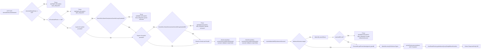

# 11 GET /annotate/structuralVariants

```mermaid
flowchart LR
  A["HTTP GET /annotate/structuralVariants"] --> B{"structuralVariantType == null?"}
  B -- Yes --> C["Throw ApiHttpErrorException BAD_REQUEST"]
  B -- No --> D{"isFunctionalFusion == null?"}
  D -- Yes --> E["Throw ApiHttpErrorException BAD_REQUEST"]
  D -- No --> F{"A gene id+symbol provided?"}

  F -- Yes --> G{"GeneUtils.isSameGene(entrezGeneIdA,hugoSymbolA)?"}
  G -- No --> H["Throw ApiHttpErrorException BAD_REQUEST geneA mismatch"]
  G -- Yes --> I{"B gene id+symbol provided?"}
  F -- No --> I

  I -- Yes --> J{"GeneUtils.isSameGene(entrezGeneIdB,hugoSymbolB)?"}
  J -- No --> K["Throw ApiHttpErrorException BAD_REQUEST geneB mismatch"]
  J -- Yes --> L["Resolve GeneA and GeneB"]
  I -- No --> L

  L --> M["GeneA resolution: cacheFetcher.findGeneBySymbol try/catch, fallback to input fields"]
  M --> N["GeneB resolution: cacheFetcher.findGeneBySymbol try/catch, fallback to input fields"]
  N --> O["resolveMatchedRG(referenceGenome)"]

  O --> P{"referenceGenome empty?"}
  P -- No --> Q["MainUtils.searchEnum"]
  Q --> R{"matchedRG null?"}
  R -- Yes --> S["Throw ApiHttpErrorException BAD_REQUEST invalid referenceGenome"]
  R -- No --> T["FusionUtils.getFusionName(geneA,geneB)"]
  P -- Yes --> T

  T --> U["MainUtils.stringToEvidenceTypes"]
  U --> V["cacheFetcher.processQuery with SV params"]
  V --> W["JsonResultFactory.getIndicatorQueryRespWithoutGermline"]
  W --> X["Return ResponseEntity 200"]
```

## Drill-Down
- `resolveMatchedRG`: `diagram/methods/resolveMatchedRG.md`
