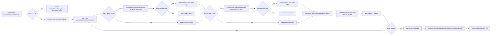

# 12 POST /annotate/structuralVariants

```mermaid
flowchart LR
  A["HTTP POST /annotate/structuralVariants"] --> B{body == null?}
  B -- Yes --> C["Throw ApiHttpErrorException BAD_REQUEST"]
  B -- No --> D["annotateStructuralVariants(body)"]

  D --> E["Loop each AnnotateStructuralVariantQuery"]
  E --> F{query.geneA != null?}
  F -- Yes --> G["cacheFetcher.findGeneBySymbol for geneA in try/catch"]
  G --> H{geneA unresolved?}
  H -- Yes --> I["geneA fallback from query input"]
  H -- No --> J["use resolved geneA"]
  F -- No --> K["geneA remains empty"]

  I --> L{query.geneB != null?}
  J --> L
  K --> L
  L -- Yes --> M["cacheFetcher.findGeneBySymbol for geneB in try/catch"]
  M --> N{geneB unresolved?}
  N -- Yes --> O["geneB fallback from query input"]
  N -- No --> P["use resolved geneB"]
  L -- No --> Q["geneB remains empty"]

  O --> R["FusionUtils.getFusionName(geneA,geneB)"]
  P --> R
  Q --> R
  R --> S["cacheFetcher.processQuery with SV params"]
  S --> T["resp.query.id = query.id"]
  T --> U{More queries?}
  U -- Yes --> E
  U -- No --> V["Return list from helper"]

  V --> W["JsonResultFactory.getIndicatorQueryRespWithoutGermline"]
  W --> X["Return ResponseEntity 200"]
```

## Drill-Down
- `annotateStructuralVariants(List)`: `diagram/methods/annotateStructuralVariants-list.md`
