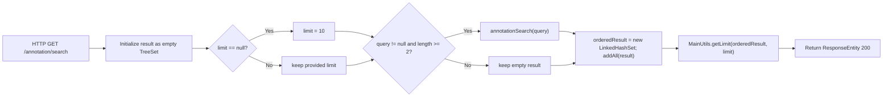

# 13 GET /annotation/search

```mermaid
flowchart LR
  A["HTTP GET /annotation/search"] --> B["Initialize result as empty TreeSet"]
  B --> C{"limit == null?"}
  C -- Yes --> D["limit = 10"]
  C -- No --> E["keep provided limit"]
  D --> F{"query != null and length >= 2?"}
  E --> F

  F -- Yes --> G["annotationSearch(query)"]
  F -- No --> H["keep empty result"]

  G --> I["orderedResult = new LinkedHashSet; addAll(result)"]
  H --> I
  I --> J["MainUtils.getLimit(orderedResult, limit)"]
  J --> K["Return ResponseEntity 200"]
```
