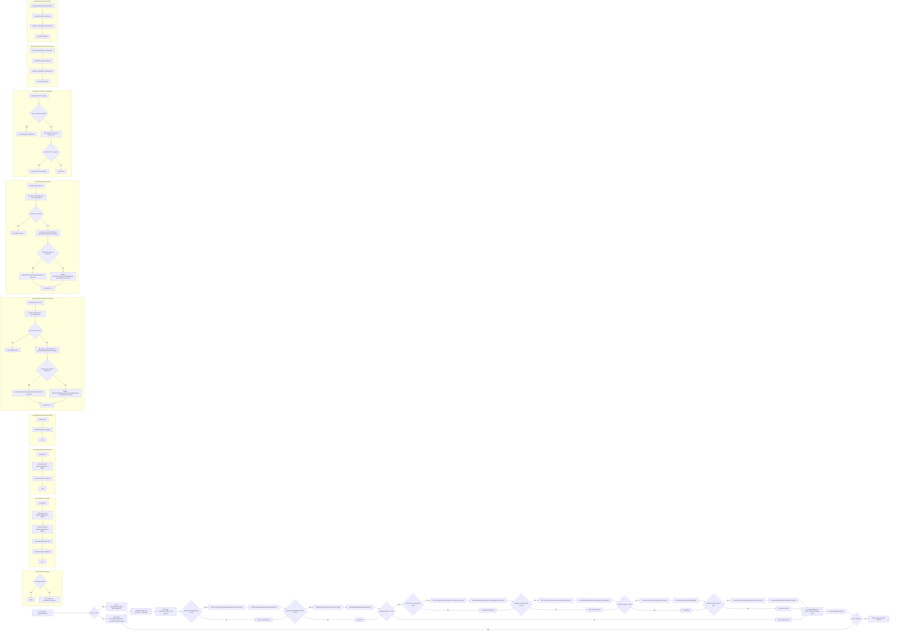

# 14 POST /annotate/sample

```mermaid
flowchart LR
  A["HTTP POST /annotate/sample"] --> B{body == null?}
  B -- Yes --> C["Throw ApiHttpErrorException BAD_REQUEST"]
  B -- No --> D["Loop each AnnotateSampleQuery -> annotateSample(sample)"]

  D --> E["annotateSample: init response + empty lists"]
  E --> F["tumorType = sample.tumorType; set on response"]

  F --> G{sample.structuralVariants != null?}
  G -- Yes --> H["setTumorTypeForQueries(structuralVariants,tumorType)"]
  H --> I["annotateStructuralVariants(structuralVariants)"]
  G -- No --> J["skip structuralVariants"]

  I --> K{sample.copyNumberAlterations != null?}
  J --> K
  K -- Yes --> L["setTumorTypeForQueries(CNA,tumorType)"]
  L --> M["annotateCopyNumberAlterations(CNA)"]
  K -- No --> N["skip CNA"]

  M --> O{sample.mutations != null?}
  N --> O
  O -- No --> P["skip mutations block"]
  O -- Yes --> Q{mutations.genomicChange != null?}

  Q -- Yes --> R["setTumorTypeForQueries(genomicChange,tumorType)"]
  R --> S["annotateMutationsByGenomicChange(genomicChange)"]
  Q -- No --> T["skip genomicChange"]

  S --> U{mutations.proteinChange != null?}
  T --> U
  U -- Yes --> V["setTumorTypeForQueries(proteinChange,tumorType)"]
  V --> W["annotateMutationsByProteinChange(proteinChange)"]
  U -- No --> X["skip proteinChange"]

  W --> Y{mutations.hgvsg != null?}
  X --> Y
  Y -- Yes --> Z["setTumorTypeForQueries(hgvsg,tumorType)"]
  Z --> A1["annotateMutationsByHGVSg(hgvsg)"]
  Y -- No --> A2["skip hgvsg"]

  A1 --> A3{mutations.cDnaChange != null?}
  A2 --> A3
  A3 -- Yes --> A4["setTumorTypeForQueries(cDnaChange,tumorType)"]
  A4 --> A5["annotateMutationsByHGVSg(cDnaChange)"]
  A3 -- No --> A6["skip cDnaChange"]

  A5 --> A7["set structuralVariants + CNA + flattened mutation lists"]
  A6 --> A7
  P --> A7

  A7 --> A8["return SampleQueryResp"]
  A8 --> A9{More samples?}
  A9 -- Yes --> D
  A9 -- No --> B1["Return ResponseEntity 200 list"]

  subgraph SET_TUMOR["setTumorTypeForQueries"]
    ST1{tumorType empty?} -- Yes --> ST2["return"]
    ST1 -- No --> ST3["loop queries -> query.setTumorType"]
  end

  subgraph SV_HELPER["annotateStructuralVariants"]
    SV1["loop queries"] --> SV2["resolve geneA via findGeneBySymbol or fallback"]
    SV2 --> SV3["resolve geneB via findGeneBySymbol or fallback"]
    SV3 --> SV4["FusionUtils.getFusionName"]
    SV4 --> SV5["cacheFetcher.processQuery"]
    SV5 --> SV6["set id"]
  end

  subgraph CNA_HELPER["annotateCopyNumberAlterations"]
    CN1["loop queries"] --> CN2["resolve gene via findGeneBySymbol or fallback"]
    CN2 --> CN3["cacheFetcher.processQuery"]
    CN3 --> CN4["set id"]
  end

  subgraph PROTEIN_HELPER["annotateMutationsByProteinChange"]
    P1["loop queries"] --> P2["cacheFetcher.processQuery"]
    P2 --> P3["set id"]
  end

  subgraph GENOMIC_HELPER["annotateMutationsByGenomicChange"]
    G1["partition queries by RG"] --> G2["per RG: build GN list + fetch annotations"]
    G2 --> G3{GN count mismatch?}
    G3 -- Yes --> G4["throw ApiException"]
    G3 -- No --> G5["per query: curated HGVS via getIndicatorQueryForCuratedHgvs"]
    G5 --> G6{curated miss and non-germline?}
    G6 -- Yes --> G7["getIndicatorQueryFromGenomicLocation(selected transcript)"]
    G6 -- No --> G8["fallback getIndicatorQueryFromGenomicLocation(empty transcript) when needed"]
    G7 --> G9["set hgvsInfo + id"]
    G8 --> G9
  end

  subgraph HGVSG_HELPER["annotateMutationsByHGVSg"]
    H1["partition queries by RG"] --> H2["per RG: build GN hgvsg list + fetch annotations"]
    H2 --> H3{GN count mismatch?}
    H3 -- Yes --> H4["throw ApiException"]
    H3 -- No --> H5["per query: curated HGVS via getIndicatorQueryForCuratedHgvs"]
    H5 --> H6{curated miss and non-germline?}
    H6 -- Yes --> H7["getIndicatorQueryFromHGVS(selected transcript)"]
    H6 -- No --> H8["fallback getIndicatorQueryFromHGVS(empty transcript) when needed"]
    H7 --> H9["set hgvsInfo + id"]
    H8 --> H9
  end

  subgraph CURATED_HELPER["getIndicatorQueryForCuratedHgvs"]
    C1["lookup alteration by hgvsg"] --> C2{match + germline aligned?}
    C2 -- Yes --> C3["cacheFetcher.processQuery"]
    C2 -- No --> C4["extract hgvsc and lookup by hgvsc part"]
    C4 --> C5{second match + aligned?}
    C5 -- Yes --> C6["cacheFetcher.processQuery"]
    C5 -- No --> C7["return null"]
  end

  subgraph FROM_LOC["getIndicatorQueryFromGenomicLocation"]
    L1["QueryUtils.getQueryFromAlteration"] --> L2["cacheFetcher.processQuery"]
    L2 --> L3["addTranscriptAndExonToResponse"]
    L3 --> L4["set query.hgvsInfo"]
  end

  subgraph FROM_HGVS["getIndicatorQueryFromHGVS"]
    V1["QueryUtils.getQueryFromAlteration"] --> V2["cacheFetcher.processQuery"]
    V2 --> V3["addTranscriptAndExonToResponse"]
    V3 --> V4["set query.hgvsInfo"]
  end
```

## Drill-Down
- `annotateSample`: `diagram/methods/annotateSample.md`
