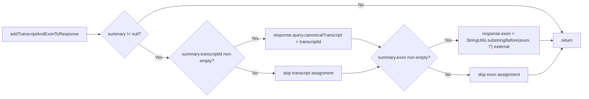

# addTranscriptAndExonToResponse(IndicatorQueryResp, TranscriptConsequenceSummary)

```mermaid
flowchart LR
  A["addTranscriptAndExonToResponse"] --> B{summary != null?}
  B -- No --> C["return"]
  B -- Yes --> D{summary.transcriptId non-empty?}
  D -- Yes --> E["response.query.canonicalTranscript = transcriptId"]
  D -- No --> F["skip transcript assignment"]
  E --> G{summary.exon non-empty?}
  F --> G
  G -- Yes --> H["response.exon = StringUtils.substringBefore(exon, '/') external"]
  G -- No --> I["skip exon assignment"]
  H --> C
  I --> C
```
