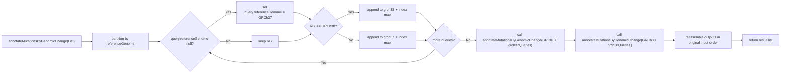

# annotateMutationsByGenomicChange(List<AnnotateMutationByGenomicChangeQuery>)

```mermaid
flowchart LR
  A["annotateMutationsByGenomicChange(List)"] --> B["partition by referenceGenome"]
  B --> C{"query.referenceGenome null?"}
  C -- Yes --> D["set query.referenceGenome = GRCh37"]
  C -- No --> E["keep RG"]
  D --> F{"RG == GRCh38?"}
  E --> F
  F -- Yes --> G["append to grch38 + index map"]
  F -- No --> H["append to grch37 + index map"]
  G --> I{"more queries?"}
  H --> I
  I -- Yes --> C
  I -- No --> J["call annotateMutationsByGenomicChange(GRCh37, grch37Queries)"]
  J --> K["call annotateMutationsByGenomicChange(GRCh38, grch38Queries)"]
  K --> L["reassemble outputs in original input order"]
  L --> M["return result list"]
```

Downstream method: `diagram/methods/annotateMutationsByGenomicChange-rg-list.md`
