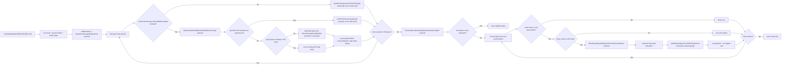

# annotateMutationsByHGVSc(ReferenceGenome, List<AnnotateMutationByHGVScQuery>)

```mermaid
flowchart LR
  A["annotateMutationsByHGVSc(RG,List)"] --> B["init result + queriesToGN + index maps"]
  B --> C["allAlterations = AlterationUtils.getAllAlterations external"]

  C --> D["first pass loop queries"]
  D --> E{"cacheFetcher.hgvscShouldBeAnnotated external?"}
  E -- No --> F["getIndicatorQueryFromHGVS(empty transcript); set id; add result"]
  E -- Yes --> G["AlterationUtils.findAlterationWithGeneticType external"]
  G --> H{"germline OR curated non-germline hit?"}
  H -- Yes --> I["cacheFetcher.processQuery external; set id; add result"]
  H -- No --> J{"query.hgvsc already in GN map?"}
  J -- No --> K["build GN input from GeneUtils.getGeneByAlias external or raw hgvsc"]
  J -- Yes --> L["reuse existing GN map entry"]
  K --> M["record placeholder: result.add(null), map index->query"]
  L --> M

  F --> N{"more queries in first pass?"}
  I --> N
  M --> N
  N -- Yes --> D
  N -- No --> O["GenomeNexusUtils.getHgvsVariantsAnnotation external"]

  O --> P{"annotation count mismatch?"}
  P -- Yes --> Q["throw ApiException"]
  P -- No --> R["second pass loop over result indices"]

  R --> S{"result index is null placeholder?"}
  S -- No --> T["keep as-is"]
  S -- Yes --> U{"query exists in GN map?"}
  U -- No --> V["set null remains"]
  U -- Yes --> W["AlterationUtils.getAlterationsFromGenomeNexus external"]
  W --> X["selected transcript alteration"]
  X --> Y["getIndicatorQueryFromHGVS(selected transcript, variant hgvsg)"]
  Y --> Z["set hgvsInfo + id; replace null"]

  T --> A1{"more indices?"}
  V --> A1
  Z --> A1
  A1 -- Yes --> R
  A1 -- No --> A2["return result list"]
```

Downstream method: `diagram/methods/getIndicatorQueryFromHGVS.md`
