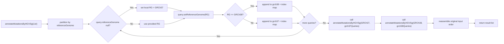

# annotateMutationsByHGVSg(List<AnnotateMutationByHGVSgQuery>)

```mermaid
flowchart LR
  A["annotateMutationsByHGVSg(List)"] --> B["partition by referenceGenome"]
  B --> C{"query.referenceGenome null?"}
  C -- Yes --> D["set local RG = GRCh37"]
  C -- No --> E["use provided RG"]
  D --> F["query.setReferenceGenome(RG)"]
  E --> F
  F --> G{"RG == GRCh38?"}
  G -- Yes --> H["append to grch38 + index map"]
  G -- No --> I["append to grch37 + index map"]
  H --> J{"more queries?"}
  I --> J
  J -- Yes --> C
  J -- No --> K["call annotateMutationsByHGVSg(GRCh37, grch37Queries)"]
  K --> L["call annotateMutationsByHGVSg(GRCh38, grch38Queries)"]
  L --> M["reassemble original input order"]
  M --> N["return result list"]
```

Downstream method: `diagram/methods/annotateMutationsByHGVSg-rg-list.md`
