# annotateMutationsByHGVSg(ReferenceGenome, List<AnnotateMutationByHGVSgQuery>)

```mermaid
flowchart LR
  A["annotateMutationsByHGVSg(RG,List)"] --> B["loop queries to build deduped queriesToGN"]
  B --> C{cacheFetcher.hgvsgShouldBeAnnotated external?}
  C -- Yes --> D{already in queryIndexMap?}
  D -- No --> E["put in map + add hgvsg"]
  D -- Yes --> F["skip add"]
  C -- No --> F
  E --> G{more queries for GN build?}
  F --> G
  G -- Yes --> B
  G -- No --> H["GenomeNexusUtils.getHgvsVariantsAnnotation external"]

  H --> I{annotation count mismatch?}
  I -- Yes --> J["throw ApiException"]
  I -- No --> K["allAlterations = AlterationUtils.getAllAlterations external"]

  K --> L["loop each query for response"]
  L --> M{query in queryIndexMap?}
  M -- No --> N["getIndicatorQueryFromHGVS(empty transcript)"]
  M -- Yes --> O["AlterationUtils.getAlterationsFromGenomeNexus external"]
  O --> P["selected transcript alteration"]
  P --> Q["getIndicatorQueryForCuratedHgvs"]
  Q --> R{indicator null and not germline?}
  R -- Yes --> S["getIndicatorQueryFromHGVS(selected transcript)"]
  R -- No --> T["keep current indicator"]

  S --> U["set hgvsInfo"]
  U --> V["set response query id"]
  T --> W{indicator still null?}
  W -- Yes --> N
  W -- No --> V
  N --> V

  V --> X{more queries?}
  X -- Yes --> L
  X -- No --> Y["return result list"]
```

Downstream methods:
- `diagram/methods/getIndicatorQueryForCuratedHgvs.md`
- `diagram/methods/getIndicatorQueryFromHGVS.md`
