# annotateSample(AnnotateSampleQuery)

```mermaid
flowchart LR
  A["annotateSample(sample)"] --> B["init response + output lists"]
  B --> C["set response id and tumorType"]

  C --> D{sample.structuralVariants != null?}
  D -- Yes --> E["setTumorTypeForQueries(structuralVariants)"]
  E --> F["annotateStructuralVariants(structuralVariants)"]
  D -- No --> G["skip"]

  F --> H{sample.copyNumberAlterations != null?}
  G --> H
  H -- Yes --> I["setTumorTypeForQueries(CNA)"]
  I --> J["annotateCopyNumberAlterations(CNA)"]
  H -- No --> K["skip"]

  J --> L{sample.mutations != null?}
  K --> L
  L -- No --> M["skip mutation block"]
  L -- Yes --> N{mutations.genomicChange != null?}

  N -- Yes --> O["setTumorTypeForQueries(genomicChange)"]
  O --> P["annotateMutationsByGenomicChange(genomicChange)"]
  N -- No --> Q["skip genomic"]

  P --> R{mutations.proteinChange != null?}
  Q --> R
  R -- Yes --> S["setTumorTypeForQueries(proteinChange)"]
  S --> T["annotateMutationsByProteinChange(proteinChange)"]
  R -- No --> U["skip protein"]

  T --> V{mutations.hgvsg != null?}
  U --> V
  V -- Yes --> W["setTumorTypeForQueries(hgvsg)"]
  W --> X["annotateMutationsByHGVSg(hgvsg)"]
  V -- No --> Y["skip hgvsg"]

  X --> Z{mutations.cDnaChange != null?}
  Y --> Z
  Z -- Yes --> A1["setTumorTypeForQueries(cDnaChange)"]
  A1 --> A2["annotateMutationsByHGVSg(cDnaChange)"]
  Z -- No --> A3["skip cDna"]

  A2 --> A4["set response SV + CNA + flattened mutation list"]
  A3 --> A4
  M --> A4
  A4 --> A5["return SampleQueryResp"]
```

Downstream methods:
- `diagram/methods/setTumorTypeForQueries.md`
- `diagram/methods/annotateStructuralVariants-list.md`
- `diagram/methods/annotateCopyNumberAlterations-list.md`
- `diagram/methods/annotateMutationsByGenomicChange-list.md`
- `diagram/methods/annotateMutationsByProteinChange-list.md`
- `diagram/methods/annotateMutationsByHGVSg-list.md`
