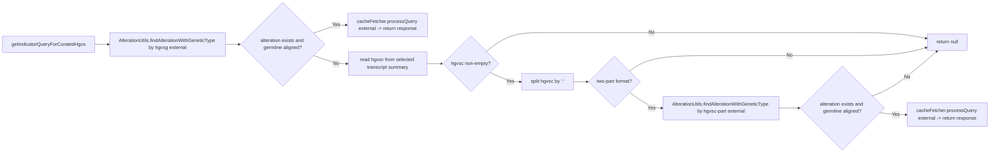

# getIndicatorQueryForCuratedHgvs(...)

```mermaid
flowchart LR
  A["getIndicatorQueryForCuratedHgvs"] --> B["AlterationUtils.findAlterationWithGeneticType by hgvsg external"]
  B --> C{alteration exists and germline aligned?}
  C -- Yes --> D["cacheFetcher.processQuery external -> return response"]
  C -- No --> E["read hgvsc from selected transcript summary"]
  E --> F{hgvsc non-empty?}
  F -- No --> G["return null"]
  F -- Yes --> H["split hgvsc by ':'"]
  H --> I{two-part format?}
  I -- No --> G
  I -- Yes --> J["AlterationUtils.findAlterationWithGeneticType by hgvsc-part external"]
  J --> K{alteration exists and germline aligned?}
  K -- Yes --> L["cacheFetcher.processQuery external -> return response"]
  K -- No --> G
```
