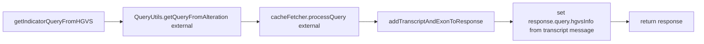

# getIndicatorQueryFromHGVS(...)

```mermaid
flowchart LR
  A[getIndicatorQueryFromHGVS] --> B[QueryUtils.getQueryFromAlteration external]
  B --> C[cacheFetcher.processQuery external]
  C --> D[addTranscriptAndExonToResponse]
  D --> E[set response.query.hgvsInfo from transcript message]
  E --> F[return response]
```

Downstream method: `diagram/methods/addTranscriptAndExonToResponse.md`
