# processQuery (CacheFetcher + IndicatorUtils)

```mermaid
flowchart LR
  A["CacheFetcher.processQuery"] --> B{"referenceGenome == null?"}
  B -- Yes --> C["referenceGenome = DEFAULT_REFERENCE_GENOME"]
  B -- No --> D["Keep provided referenceGenome"]
  C --> E["Build Query from parameters"]
  D --> E
  E --> F["IndicatorUtils.processQuery(query, levels, highestLevelOnly, evidenceTypes, geneQueryOnly)"]

  subgraph IU["IndicatorUtils.processQuery"]
    I1["Normalize highestLevelOnly and levels"] --> I2{"evidenceTypes empty?"}
    I2 -- Yes --> I3["Use all default evidence types by germline flag"]
    I2 -- No --> I4["Use provided evidence types"]
    I3 --> I5["Derive evidence flags treatment dx px oncogenic mutationEffect"]
    I4 --> I5

    I5 --> I6["Create response and attach query"]
    I6 --> I7{"query == null?"}
    I7 -- Yes --> I8["Return empty response"]
    I7 -- No --> I9["Normalize tumorType aliases then query.enrich"]

    I9 --> I10{"alteration contains intragenic?"}
    I10 -- Yes --> I11["Convert query to structural variant deletion style"]
    I10 -- No --> I12["Keep query alteration fields"]
    I11 --> I13{"AlterationType is fusion or structural variant?"}
    I12 --> I13

    I13 -- Yes --> I14["findFusionGeneAndRelevantAlts"]
    I13 -- No --> I15["Resolve gene + alteration + relevant alterations"]

    I14 --> I16{"fusionGeneAltsMap has multi-gene candidates?"}
    I16 -- Yes --> I17["Recurse IndicatorUtils.processQuery per candidate gene and return best"]
    I16 -- No --> I18["Continue with picked gene and relevant alterations"]
    I15 --> I19{"gene resolved?"}
    I18 --> I19

    I19 -- No --> I20["response.geneExist = false"]
    I19 -- Yes --> I21["Set query gene fields and geneExist"]

    I21 --> I22["Resolve matchedAlt variantExist alleles hotspot VUS"]
    I22 --> I23{"nonVUS relevant alterations exist?"}
    I23 -- No --> I24["Skip oncogenic and mutation-effect derivation"]
    I23 -- Yes --> I25{"query is germline?"}
    I25 -- Yes --> I26["Set germline info and mutation effect evidence"]
    I25 -- No --> I27["Set oncogenicity and mutation effect when requested"]

    I24 --> I28{"has treatment evidence?"}
    I26 --> I28
    I27 --> I28
    I28 -- Yes --> I29["Collect treatment evidences and optionally highest-level filter"]
    I28 -- No --> I30["Skip treatment block"]

    I29 --> I31["Build treatments and highest level fields"]
    I30 --> I32{"has dx or px implication evidence?"}
    I31 --> I32
    I32 -- Yes --> I33["Build diagnostic and prognostic implications"]
    I32 -- No --> I34["Skip implication blocks"]

    I33 --> I35{"summary evidence requested?"}
    I34 --> I35
    I35 -- Yes --> I36["Build tumor type mutation diagnostic prognostic summaries"]
    I35 -- No --> I37["Skip summary blocks"]

    I36 --> I38{"special KRAS or NRAS wildtype case?"}
    I37 --> I38
    I38 -- Yes --> I39["Apply KRAS NRAS wildtype override logic"]
    I38 -- No --> I40["No wildtype override"]

    I20 --> I41["Apply inferred oncogenic fallback if needed"]
    I39 --> I41
    I40 --> I41
    I41 --> I42["Default mutationEffect if missing"]
    I42 --> I43["Set dataVersion and compute lastUpdate from evidences"]
    I43 --> I44{"oncogenic unset?"}
    I44 -- Yes --> I45["Set oncogenic to Unknown"]
    I44 -- No --> I46["Keep oncogenic"]
    I45 --> I47["Return IndicatorQueryResp"]
    I46 --> I47
  end
```

Source methods:
- `core/src/main/java/org/mskcc/cbio/oncokb/cache/CacheFetcher.java`
- `core/src/main/java/org/mskcc/cbio/oncokb/util/IndicatorUtils.java`
