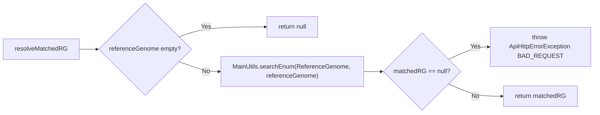

# resolveMatchedRG(String referenceGenome)

```mermaid
flowchart LR
  A["resolveMatchedRG"] --> B{referenceGenome empty?}
  B -- Yes --> C["return null"]
  B -- No --> D["MainUtils.searchEnum(ReferenceGenome, referenceGenome)"]
  D --> E{matchedRG == null?}
  E -- Yes --> F["throw ApiHttpErrorException BAD_REQUEST"]
  E -- No --> G["return matchedRG"]
```
